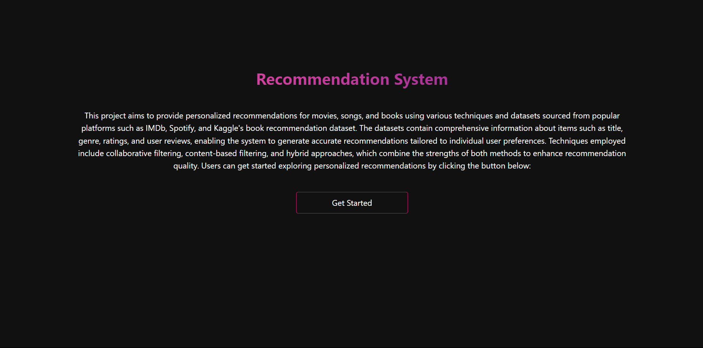
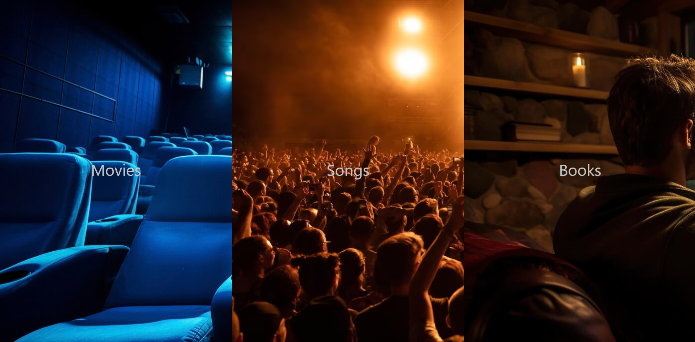

# Recommendation System



This is a recommendation system project. The project is structured as a Python application with a Django backend.

## The Project has 3 Recommendation Systems



- Songs Recommendation System
- Movies Recommendation System
- Books Recommendation System

1. **Songs Recommendation System:**
    - The Songs Recommendation System is based on the content-based filtering technique.
    - The system recommends songs based on the user's input.
    - The system uses the cosine similarity technique to recommend songs.

2. **Movies Recommendation System:**
    - The Movies Recommendation System is based on the content based filtering technique.
    - The system recommends movies based on the user's input.
    - The system uses the cosine similarity technique to recommend movies.

3. **Books Recommendation System:**
    - The Books Recommendation System is based on the collaborative filtering technique.
    - The system recommends books based on the user's input.
    - The system uses the euclidean distance technique to recommend books.

## Getting Started

These instructions will get you a copy of the project up and running on your local machine for development and testing purposes.

### Prerequisites

What things you need to install the software and how to install them.

```sh

conda create -p venv python=3.11

conda activate venv

git clone https://github.com/CC-KEH/Recommendation-System.git

pip install -r requirements.txt

python manage.py runserver
```
